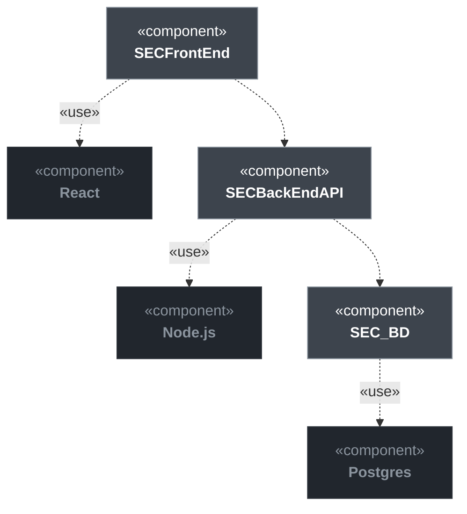
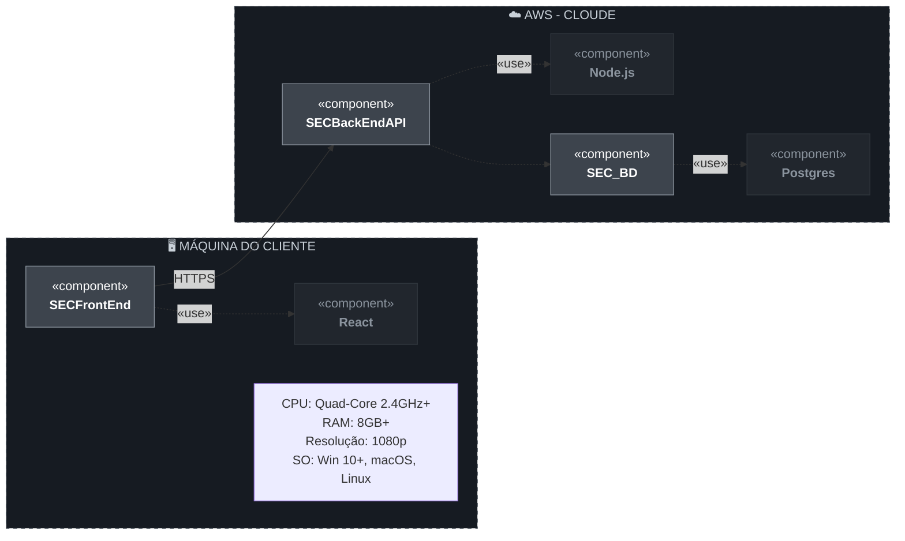

# Visão da Demanda (VD) - Sistema ENADE Comentado (SEC)

## Histórico de Versões

| Data | Versão | Descrição | Autor |
| :--- | :--- | :--- | :--- |
| 02/05/2026 | 1.0 | Criação do documento de visão e definição do escopo inicial | Juliana |
| 12/05/2026 | 1.1 | Atualização dos atores descritos nas funcionalidades e da descrição da arquitetura | Juliana |
| 13/05/2026 | 1.2 | Inclusão de permissões de cadastro para professores e visualização para coordenadores | Juliana |
| 15/05/2026 | 1.3 | Inclusão dos diagramas de componentes e deployment | Juliana |

## 1. Objetivo

Definir a proposta de valor e o escopo do sistema de questões comentadas do ENADE, detalhando as necessidades dos estudantes de graduação, coordenações de curso e professores. O projeto foca na aplicação da engenharia de requisitos para especificar uma solução web responsiva que auxilie no preparo para o exame.

## 2. Proposta de valor

O sistema permitirá democratizar o acesso a materiais de estudo de alta qualidade, oferecendo uma plataforma organizada para a prática de simulados com feedback imediato. Espera-se uma melhoria significativa no desempenho dos estudantes e o fornecimento de indicadores reais de qualidade para a gestão acadêmica.

## 3. Descrição da demanda

A demanda surge da dificuldade enfrentada pelos estudantes em se preparar para o ENADE devido à escassez de materiais organizados e simulados práticos. O sistema funcionará como um hub educacional para:
* Prática de simulados cronometrados
* Consulta de gabaritos detalhados e comentados
* Acompanhamento de estatísticas de desempenho por área de conhecimento
* Interação colaborativa através de fóruns de discussão
* Cadastro de questões em padrão ENADE

Todo o processo será digital, com autenticação de usuários e histórico de simulados e comentários.

Permitirá também ao estudante consultar o banco de questões por área de conhecimento, bem como o acompanhamento de sua evolução pedagógica.

Não está no escopo dessa demanda a emissão de certificados oficiais de conclusão de curso ou a inscrição formal no exame junto ao MEC.

## 4. Partes interessadas

| Nome | Papel | Responsabilidades | Representante |
| :--- | :--- | :--- | :--- |
| **Estudante** | Usuário Final | Realizar simulados, consultar gabaritos e interagir no fórum. | - |
| **Coordenação de Curso** | Cliente | Acompanhar indicadores de desempenho, evolução das turmas e monitorar o cadastro de questões. | - |
| **Professores** | Stakeholder | Prover apoio pedagógico, validar comentários técnicos e alimentar o banco de questões de sua área/curso. | - |
| **Equipe de TI** | Desenvolvimento | Implementar e manter o sistema. | - |
| **INEP** | Fornecedor | Prover o padrão oficial de questões | - |

## 5. Personas

### 5.1. Aluno concluinte
- **Descrição:** Aluno matriculado em curso de ensino superior que deve realizar o ENADE como componente curricular obrigatório.
- **Objetivo:** Praticar com questões reais, entender erros através de comentários e monitorar sua evolução por área de conhecimento.

### 5.2. Coordenador de curso
- **Descrição:** Responsável pela gestão acadêmica do curso de graduação.
- **Objetivo:** Identificar lacunas de aprendizado no corpo discente e ter visibilidade das questões que estão sendo cadastradas pelos professores.

### 5.3. Professor
- **Descrição:** Docente especialista responsável por prover apoio pedagógico e técnico aos estudantes na plataforma.
- **Objetivo:** Inserir comentários técnicos, sanar dúvidas nos fóruns e cadastrar novas questões específicas de sua área de atuação seguindo os padrões do INEP.

### 5.4. Administrador
- **Descrição:** Integrante da equipe de suporte técnico.
- **Objetivo:** Manter o banco de questões atualizado conforme as publicações do INEP, gerenciar permissões de usuários e moderar fóruns de discussão.

## 6. Necessidades e funcionalidades

### Necessidade 1: Prática e simulação de exame

#### F1.1 Realização de simulados cronometrados
* **Descrição:** Permite realizar testes com tempo limitado para simular a experiência real do exame.
* **Incluída**
* **Atores:** Aluno concluinte
* **Frequência:** Alta
* **Valor:** Alto

#### F1.2 Seleção de questões por filtro
* **Descrição:** Filtro por ano, curso e tipo de componente (Formação Geral ou Conhecimento Específico).
* **Incluída**
* **Atores:** Aluno concluinte
* **Frequência:** Média
* **Valor:** Médio

---

### Necessidade 2: Feedback e estudo dirigido

#### F2.1 Exibição de gabarito comentado
* **Descrição:** Apresenta explicações detalhadas sobre a resposta correta e as incorretas.
* **Incluída**
* **Atores:** Aluno concluinte
* **Frequência:** Alta
* **Valor:** Alto

#### F2.2 Fórum de discussão por questão
* **Descrição:** Espaço para troca de conhecimento, onde o acesso dos atores é restrito aos fóruns das questões vinculadas à sua área/curso.
* **Incluída**
* **Atores:** Aluno concluinte, Professor
* **Frequência:** Média
* **Valor:** Médio

---

### Necessidade 3: Monitoramento de desempenho

#### F3.1 Painel de estatísticas individuais
* **Descrição:** Gráficos de desempenho por área de conhecimento para o aluno.
* **Incluída**
* **Atores:** Aluno concluinte
* **Frequência:** Média
* **Valor:** Alto

#### F3.2 Relatório gerencial de turmas
* **Descrição:** Visão consolidada para a coordenação identificar lacunas de aprendizagem.
* **Incluída**
* **Atores:** Coordenador de curso
* **Frequência:** Média
* **Valor:** Alto

---

### Necessidade 4: Gestão de acesso e dados

#### F4.1 Autenticação e Perfil
* **Descrição:** Login seguro para diferenciar estudantes, professores, coordenador e administrador.
* **Incluída**
* **Atores:** Aluno concluinte, Coordenador de curso, Professor, Administrador
* **Frequência:** Alta
* **Valor:** Alto

#### F4.2 Manutenção global do banco de questões
* **Descrição:** Permite ao administrador cadastrar, editar e organizar qualquer questão do sistema.
* **Incluída**
* **Atores:** Administrador
* **Frequência:** Baixa
* **Valor:** Médio

#### F4.3 Cadastro restrito de questões
* **Descrição:** Permite ao professor cadastrar e editar apenas questões de sua área/curso.
* **Incluída**
* **Atores:** Professor
* **Frequência:** Média
* **Valor:** Alto

#### F4.4 Visualização de acervo em construção
* **Descrição:** Permite ao coordenador visualizar as questões que estão sendo cadastradas pelos professores de seu curso.
* **Incluída**
* **Atores:** Coordenador de curso
* **Frequência:** Baixa
* **Valor:** Médio

## 7. Arquitetura da demanda

### Descrição da arquitetura

O sistema será uma aplicação web responsiva, estruturada para suportar alta escalabilidade de dados (banco de questões).

### 7.1. Diagramas UML

#### 7.1.1. Diagrama de Caso de Uso

#### 7.1.2. Diagrama de Componentes

**Componentes principais:**
- FrontEnd
- BackEnd
- BD

#### 7.1.3. Diagrama de Implantação

**Ambiente de execução:**

- Camada Cliente (Navegador Web): É o ambiente de front-end onde a interface do usuário é processada. Ele executa a aplicação construída em **React**, permitindo que os usuários interajam com o sistema via navegador em diferentes sistemas operacionais.
- Camada de Aplicação (Node.js): Localizado na infraestrutura de nuvem (AWS Cloud), este ambiente é responsável pela execução da lógica de negócio. Ele hospeda a **SECBackEndAPI**, processando as requisições enviadas pelo cliente e aplicando as regras do sistema.
- Camada de Dados (SGBD SQL): O ambiente crítico para a persistência das informações. Ele utiliza o motor do **PostgreSQL** para garantir a integridade, armazenamento e consulta dos dados.
- Protocolo de Comunicação (HTTPS): Atua como o ambiente de tráfego seguro que interliga a Camada Cliente à Camada de Aplicação.

---

## Checklist de Validação do Documento de Visão

- [X] O objetivo está claro e alinhado ao problema/necessidade? 
- [X] A proposta de valor é mensurável e relevante? 
- [X] Todas as partes interessadas estão listadas com papéis definidos? 
- [X] Existem pelo menos duas personas descritas?
- [X] Todas as necessidades e funcionalidades estão relacionadas a atores? 
- [X] Há indicação de valor e frequência para cada funcionalidade?
- [ ] A arquitetura está ilustrada (através de diagramas UML em anexo)? 
- [X] O documento está escrito em linguagem clara e objetiva?
